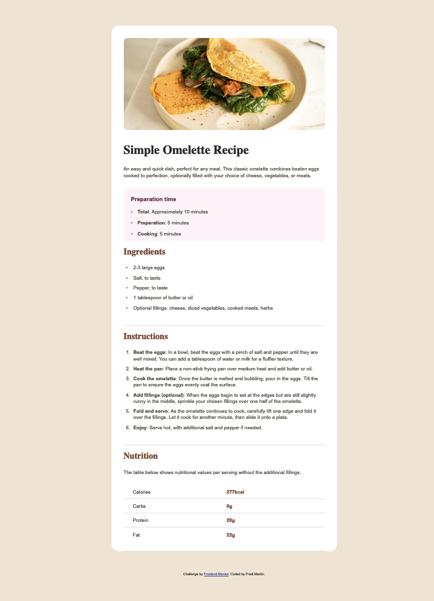

# Frontend Mentor - Recipe page solution

This is a solution to the [Recipe page challenge on Frontend Mentor](https://www.frontendmentor.io/challenges/recipe-page-KiTsR8QQKm). Frontend Mentor challenges help you improve your coding skills by building realistic projects. 

## Table of contents

- [Overview](#overview)
  - [The challenge](#the-challenge)
  - [Screenshot](#screenshot)
  - [Links](#links)
- [My process](#my-process)
  - [Built with](#built-with)
  - [What I learned](#what-i-learned)
  - [Continued development](#continued-development)
  - [Useful resources](#useful-resources)
- [Author](#author)
- [Acknowledgments](#acknowledgments)

## Overview

### Screenshot



### Links

- Live Site URL: [Add live site URL here](https://recipe-page-fmartinmorateam.vercel.app/)

## My process

### Built with

- Semantic HTML5 markup
- CSS custom properties
- Flexbox

### What I learned

```css
/* Estilos para pantallas pequeñas */
@media (max-width: 768px) {
    .card {
      width: 95%; /* Más ajustado en dispositivos pequeños */
      margin: 16px auto; /* Reduce márgenes en dispositivos pequeños */
    }
  
    img {
      margin: 20px; /* Reduce márgenes de las imágenes */
      width: calc(100% - 40px); /* Ajusta el ancho */
    }
  }
```
## Author

- Frontend Mentor - [@fmartinmora](https://www.frontendmentor.io/profile/fmartinmora)
- Twitter - [@fmartinmora](https://www.twitter.com/fmartinmora)
- Linkedin - [@fredi-martin](https://www.linkedin.com/in/fredi-martin/)
